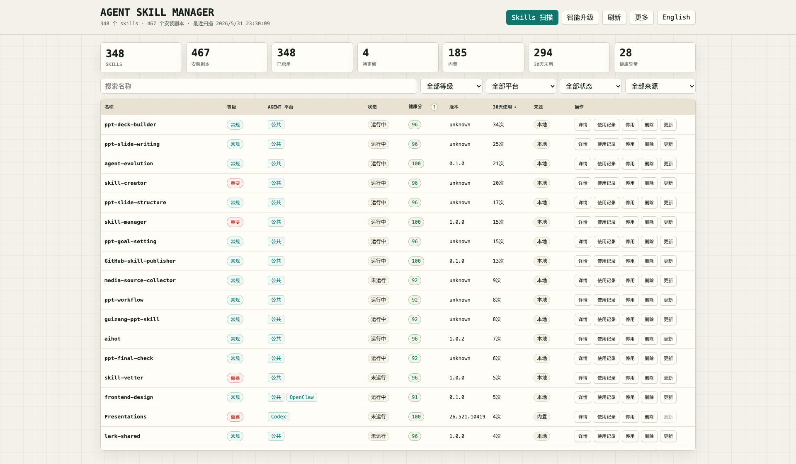

# Agent Skill Manager

A local dashboard for keeping agent skills under control across Codex, Claude Code, OpenClaw, Hermes, and public skill folders.

[中文](./README.zh.md) | English

I built Agent Skill Manager because my local skills folder kept growing, and at some point it became hard to answer simple questions: which skills are still useful, which ones are duplicated, which ones are built in, which ones have not been used for a long time, and which copies are safe to update or remove.

This tool scans local skill directories, groups the same skill across platforms, shows usage and health information, and gives you a small local admin page for day-to-day cleanup.



## What You Can Use It For

- See all local skills in one table instead of opening several hidden folders.
- Check which Agent platform a skill belongs to: Codex, Claude Code, OpenClaw, Hermes, or public.
- Find duplicate skills and inconsistent local versions.
- See 30-day usage counts imported from local session logs when those logs are available.
- Check health scores based on status, metadata, and file structure.
- Add your own skill source folders.
- Export a simple management report.
- Review update candidates and unify local copies when versions differ.
- Disable or delete skills with confirmation and backup.

## Who It Is For

This is mainly for people who already have a growing local skill library.

It is useful if you:

- use more than one Agent platform;
- install or write skills often;
- want to clean old skills without guessing;
- need a quick way to see where a skill is installed;
- want a Chinese/English local management UI.

If you only have a handful of skills, a file browser may be enough.

## How It Works

Agent Skill Manager keeps its own local registry. A scan reads known local skill folders, detects skill-like folders, groups copies by name, imports usage records where possible, and stores the result in SQLite.

The dashboard is just a view over that local registry. When you scan again, it refreshes the installed copies, usage counts, health scores, source labels, and update hints. Actions such as disable, update, and delete are handled from the same registry so the table and reports stay in sync.

Default roots include:

- public: `~/.agents/skills`
- Codex: `~/.codex/skills`, `~/.codex/plugins/cache`
- Claude Code: `~/.claude/commands`, `~/.claude/agents`, project `.claude/commands`, project `.claude/agents`
- OpenClaw: `~/.openclaw/skills`, `~/.openclaw/plugins`, `~/.openclaw/tools`, `~/.openclaw/workflows`
- Hermes: `~/.hermes`

You can change these from the local dashboard after the first run.

## Install

Install it like a normal local skill:

```bash
git clone https://github.com/chemny/agent-skill-manager.git ~/.agents/skills/skill-manager
```

After installation, start a new agent session and use it like any other skill.

## Quick Start

Ask your agent:

```text
Use skill-manager to scan my local skills and open the admin dashboard.
```

If you want to run it directly from the terminal:

```bash
python3 ~/.agents/skills/skill-manager/scripts/agent_skill_manager.py scan
python3 ~/.agents/skills/skill-manager/scripts/agent_skill_manager.py web --host 127.0.0.1 --port 8765 --open
```

The first command scans your local skills. The second command opens the dashboard.

## Common Commands

```bash
python3 scripts/agent_skill_manager.py scan
python3 scripts/agent_skill_manager.py list
python3 scripts/agent_skill_manager.py search skill-manager
python3 scripts/agent_skill_manager.py show skill-manager
python3 scripts/agent_skill_manager.py usage --days 30
python3 scripts/agent_skill_manager.py health
python3 scripts/agent_skill_manager.py report
python3 scripts/agent_skill_manager.py web --open
```

On Unix-like systems:

```bash
bin/asm scan
bin/asm web --open
```

On Windows:

```powershell
powershell -ExecutionPolicy Bypass -File ".\scripts\skill-manager.ps1" -Action Scan
powershell -ExecutionPolicy Bypass -File ".\scripts\skill-manager.ps1" -Action Web
```

## The Dashboard

The local HTML dashboard is the easiest way to use the tool. It includes:

- Chinese and English UI switching;
- skill scan and refresh;
- filters for grade, platform, status, and source;
- name-only search;
- details and usage records;
- custom source management;
- smart upgrade checks with a 24-hour cache;
- local version unification;
- soft enable/disable status;
- delete with confirmation and backup;
- report export.

Start it with:

```bash
python3 scripts/agent_skill_manager.py web --host 127.0.0.1 --port 8765 --open
```

## Runtime Files

Runtime data is not stored in this repository.

- database: `~/.agent-skill-manager/skills.db`
- config: `~/.agent-skill-manager/config.json`
- reports: `~/.agent-skill-manager/reports/`
- backups: `~/.agent-skill-manager/backups/`
- logs: `~/.agent-skill-manager/logs/`

Use `ASM_HOME` if you want a separate runtime directory:

```bash
ASM_HOME=/tmp/asm-test python3 scripts/agent_skill_manager.py list
```

## Compatibility

Agent Skill Manager is designed to work across Codex, Claude Code, OpenClaw, Hermes, and public skill directories.

It uses local filesystem scans, `SKILL.md` metadata, SQLite, and the Python standard library. Platform paths are defaults, not hard requirements.

## Safety Notes

The tool is intentionally conservative:

- builtin and plugin-cache skills are treated as observe-only;
- disable is a soft registry status, not a direct rewrite of every platform's runtime config;
- delete asks for confirmation and backs up editable files first;
- remote update checks use a 24-hour cache;
- if no remote update is found, local copies can still be compared and unified;
- local databases, reports, backups, logs, and usage records are ignored by Git.

## Update This Skill

If you installed with Git:

```bash
cd ~/.agents/skills/skill-manager
git pull
```

Then open a new agent session.

## Repository Structure

```text
skill-manager/
├── README.md
├── README.zh.md
├── CHANGELOG.md
├── LICENSE
├── SKILL.md
├── assets/
│   └── agent-skill-manager-dashboard.png
├── bin/
│   └── asm
└── scripts/
    ├── agent_skill_manager.py
    ├── release_check.sh
    └── skill-manager.ps1
```

## Release Check

```bash
./scripts/release_check.sh
```

This checks Python syntax, embedded JavaScript when Node.js is available, temporary runtime creation, and leftover Python cache files.

## License

MIT
